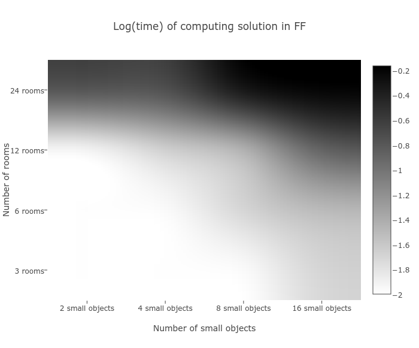
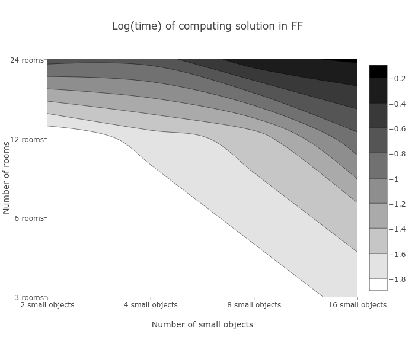
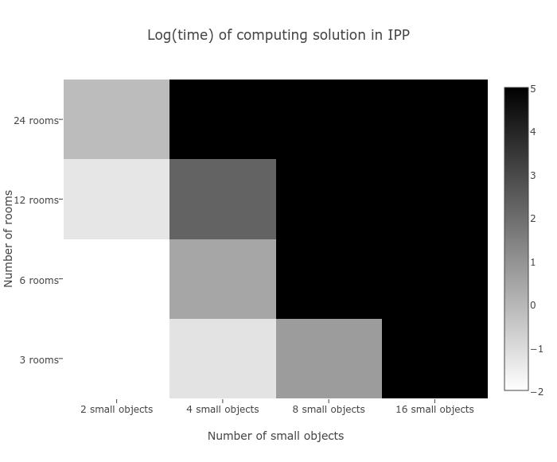
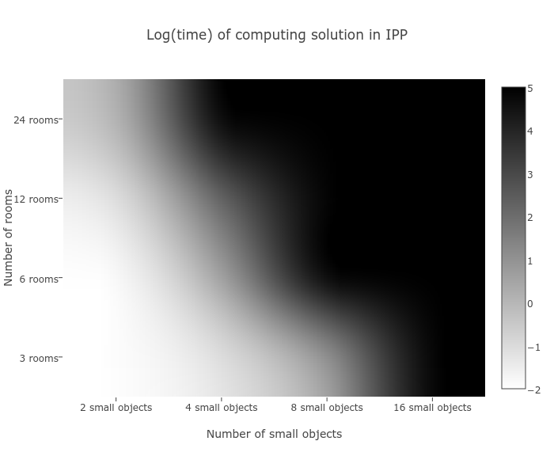
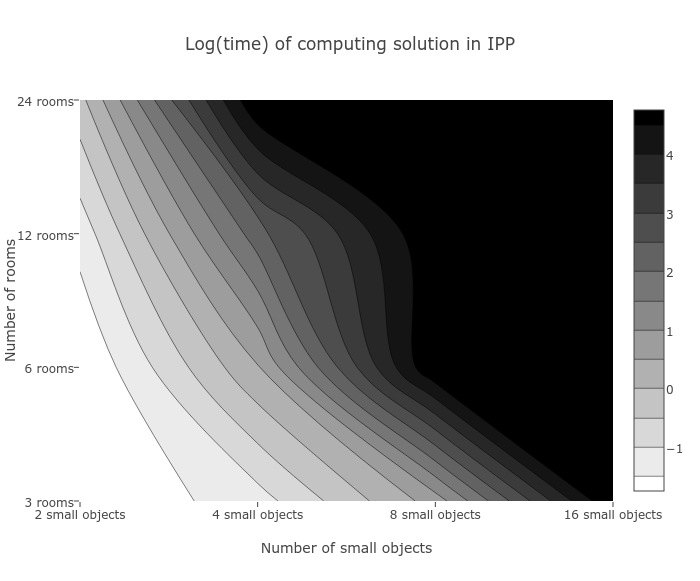

# Artificial Intelligence, Lab 4, Linköping University, Sweden, Fall 2016

Solving a planning problem (Shakey's World) with the Fast Forward (FF) and Interference Progression Planner (IPP) planners, the PDDL language and some Python meta-programming to glue things together. For more info on the task we solved, go to "Alternative 2: Shakey's World" [here](https://www.ida.liu.se/~TDDC17/info/labs/lab4_planning.en.shtml).

*By: Guillaume Chevalier and Raphaël Gaudreault.*


## Task 1

### Problem Definition

The domain and the problem file are very well commented and variable names are much verbose.

To sum up, the goal is to tidy up the room by placing every small objects on a tablet and to then turn off every lights.

- Domain: `shakey-domain.pddl`
- Problem: `shakey-task-1-alternative-2.pddl`
- Usage: `./ff -o shakey-domain.pddl -f shakey-task-1-alternative-2.pddl`

Example world from the [LiU website](https://www.ida.liu.se/~TDDC17/info/labs/lab4_planning.en.shtml):

```
-------------------------------------------------------------------------
|                       |                       |                       |
|                       |                       |                       |
|       light switch 1 -|- light switch2        |- light switch3        |
|                       |                       |                       |
|       ---             |                     door2                     |
|       | |           door1      shakey         |                       |
|       ---           (wide)                    |                       |
|       box             |                       |                       |
|                       |                     door3                     |
|                       |                     (wide)                    |
|        room1          |        room2          |         room3         |
-------------------------------------------------------------------------
```


## Task 2

### Description of Our Modified Problem

The way we scale the problem is simple: our chosen variables are the number of rows of rooms as well as the number of items to pick. We did meta-programming in Python 2 in order to output automatically variants of our problems. Here are the values for which we try every combinations, in python notation, and some other information about how we split the problem:

```python

# This is some Python 2 meta-programming to generate
# some .pddl problem files automatically from our first problem.

# Parameter 1:
# Number of small objects to pick (total)
small_objects_to_pick = [2, 4, 8, 16]

# Parameter 2:
# Number of rows of room.
rows_of_rooms = [1, 2, 4, 8]
# Each row of rooms contain 3 columns of rooms so that the total number of
# rooms is nb_of_rows*3.
# Example: 2 rows would mean 6 rooms organised in a rectangle of
# 3 rooms wide and 2 rooms of height (top view).

# Room (0, 0) always contains the box and the tablet and it
# is the starting position of Shakey.

# The number of items to pick is always distributed iteratively over
# every rooms, starting from top-left, looping with a modulo if needed.
# Every room is properly interconnected with the two door types.

```

There are more details within the code.


That said, here are the files we generate from those computations:

- `shakey-task-2-12rooms-16objs.pddl`
- `shakey-task-2-12rooms-2objs.pddl`
- `shakey-task-2-12rooms-4objs.pddl`
- `shakey-task-2-12rooms-8objs.pddl`
- `shakey-task-2-24rooms-16objs.pddl`
- `shakey-task-2-24rooms-2objs.pddl`
- `shakey-task-2-24rooms-4objs.pddl`
- `shakey-task-2-24rooms-8objs.pddl`
- `shakey-task-2-3rooms-16objs.pddl`
- `shakey-task-2-3rooms-2objs.pddl`
- `shakey-task-2-3rooms-4objs.pddl`
- `shakey-task-2-3rooms-8objs.pddl`
- `shakey-task-2-6rooms-16objs.pddl`
- `shakey-task-2-6rooms-2objs.pddl`
- `shakey-task-2-6rooms-4objs.pddl`
- `shakey-task-2-6rooms-8objs.pddl`


Note that in task 1 previously, our initial setup was containing only 3 rooms and 3 small objects, we here rather start with 10 small objects in the 3 rooms.

### Results for varying the number of items and rooms
#### Fast Forward (FF)

Total computation time in FF in function of the number of rooms and of objects:

|         | 3 rooms | 6 rooms | 12 rooms | 24 rooms |
|--------:|:-------:|:-------:|:--------:|:--------:|
| 2 small objects | 0.00 seconds | 0.00 seconds | 0.00 seconds | 0.18 seconds |
| 4 small objects | 0.00 seconds | 0.00 seconds | 0.01 seconds | 0.18 seconds |
| 8 small objects | 0.00 seconds | 0.01 seconds | 0.02 seconds | 0.54 seconds |
| 16 small objects | 0.01 seconds | 0.02 seconds | 0.13 seconds | 0.67 seconds |

Also, note that the first case with only 3 objects in 3 rooms takes 0.00 seconds.

The complexity seems to grow exponentially since such search problems generally behave that way when increasing the search domain’s size. We can confirm it by plotting the log of the time taken. It then looks like a parabola because each axis of changing variables double in magnitude at each trial. There is the plot (heatmap) for FF’s performance where the bottom axis is the number of objects and the left axis is the number of rooms:

<p align="center">
  
  
  
</p>

Note: where values were of 0.0, we took 0.002 for the log not to be infinite.

#### Interference Progression Planner (IPP)

Now, let’s see how another planner is doing, we chose IPP since its iterative deepening A* search using an admissible heuristic seems attractive and since there is no risk for assertion errors as it could happen with LAMA and because the command-line syntax is similar to the one of FF.

**Total computation time in IPP in function of the number of rooms and of objects:**

|         | 3 rooms | 6 rooms | 12 rooms | 24 rooms |
|--------:|:-------:|:-------:|:--------:|:--------:|
| 2 small objects | 0.00 seconds | 0.00 seconds | 0.04 seconds | 0.67 seconds |
| 4 small objects | 0.05 seconds | 2.85 seconds | 189.32 seconds | >10 minutes* |
| 8 small objects | 5.24 seconds | Blows RAM* | Blows RAM* | Blows RAM* |
| 16 small objects | Blows RAM* | Blows RAM* | Blows RAM* | Blows RAM* |

*We runned this on a laptop with 16GB of RAM, only 1.5GB is taken for the OS and other running apps. Our OS is Ubuntu 14.04. We also had 40 GB of HDD swap, but we limited ourselves to not go past the 16 GB of RAM since it would anyway take too much time for sure to compute the rest of the calculations using swap. Fun fact: we also tried to run this on the University's lab servers via SSH and it blew RAM too. However, we did not realize that the RAM was shared across all their linux VMs, so we caused a general slowdown of the lab computers for a moment in the weekend. We discovered for them that they should [limit the maximum usable RAM per user](https://unix.stackexchange.com/questions/34334/how-to-create-a-user-with-limited-ram-usage) and reported that for improvement.

Plotting the log(time) looks different than with FF in IPP:

<p align="center">
  
  
  
</p>

Note: where values were of 0.0, we took 0.002 for the log not to be infinite, and when it was an infinite time, we entered the value 100000. Note that `log(100000) = 5`.


### Comparison

FF, compared to IPP, calculates much, much faster, but the solution found by IPP is always optimal compared to what can happen with FF.

Both seems to grow exponentially in complexity, however FF deals better with more varied variables at once than IPP. This can be observed by how the z-curves (contour lines) vary: with FF, they are round the other way than with IPP.

That said, FF prefers when we increase the complexity of both the number of rooms and of small objects, while IPP prefers that only one of those parameters increase.

Another interesting fact is that FF seems to perform worse when we increase the number of rooms, while IPP performs worse when we instead increase the number of small objects.

A good approach to planning would be to first try with an optimal planner such as IPP, then fallback on FF if the perfect route is too long to calculate. It is to be noted that we did not really tried LAMA, which may be an even better solution to mix both approaches, because it can output suboptimal solutions before finding the best one upon searching the whole search space.


## Acknowledgements

Thanks to [www.plot.ly](www.plot.ly) for the nice web plotting service which we used for the heatmaps and contour plots.

Also thanks to LiU and its staff for making such an interesting lab.
